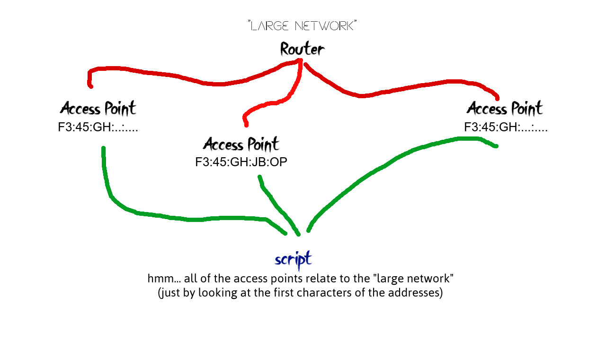

# Locats
Locats is an open source software designed to detect nearby wireless devices connected to access points.
No access point authorization needed! 
Could be used with rooted android devices (not tested)

## Dependencies 
- Aircrack-ng : ```apt-get install aircrack-ng``` 
- Python3, Python3-pip, iw, iproute2 : ```apt-get install -y python3 python3-pip iw iproute2```
- Scapy : ```pip3 install scapy```
- Wireless card monitor mode compatible
- Rename ```known_devices_example.json``` to ```known_devices.json``` and add your known mac addresses.

## Usage
After completing the program's dependencies, run ```main.py <interface>``` as root. If you don't specify the wireless interface, the program will run on ```wlan0```.

## Known Issues
- If you run into python module found error. Make sure to install those modules using sudo. After all it depends on each system's installation.
- If the program does not show any client or access point, try enabling monitor mode manually and disable it from the script

## Features
- [x] Detecting stations (clients) The program works better when few wireless devices are nearby. It is less accurate on public spaces such as malls.
- [X] Identifying them (json file, the user should append)
- [X] Identifying networks with many access points (json file to append, the program will recognize the access point even if the mac address is not exactly matching)

<div align="left">

</div>

- [ ] Android Root app 


## Platforms Support
- [x] Linux
- [x] (untested but should work) Android Root (termux)
- [ ] Android Root app

## Contributions
Contributions are highly encouraged and welcome. Please feel free to submit issues, pull requests, or discuss ideas. For further discussion, contact deftonish@proton.me

## Donations
- If you wish to help supporting my work, consider donating, small funds are always so caring.
- Bitcoin : ```bc1qfxg9wg97vklzselnayy0eutk5t9cpy048jmzzf```
- Ethereum : ```0x859477061053a5a6a72466fee128fbdff21a34ba```
- Solana : ```UDyMrbQh5LTBXAT3K22jRZCfnLpw4CwztiYcXBtvd4t```

## Disclaimer
This tool is designed for educational purposes only, here it demonstrates how easy it is to detect presence.I am not responsible for any misuse of my software!

## License
This project is licensed under the [GNU General Public License v3.0](https://www.gnu.org/licenses/gpl-3.0.html).

## Credits
This project was created and been mantained by [TenebrisOS](https://github.com/TenebrisOS)
